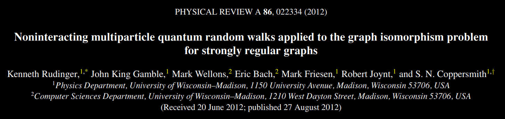
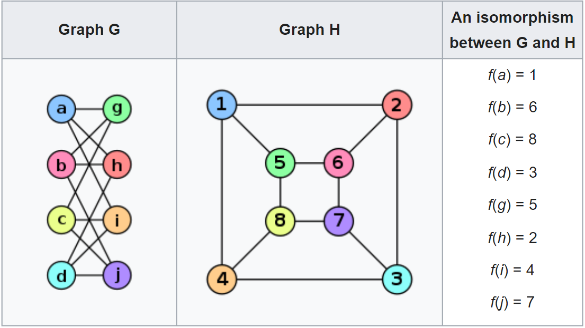
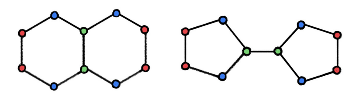
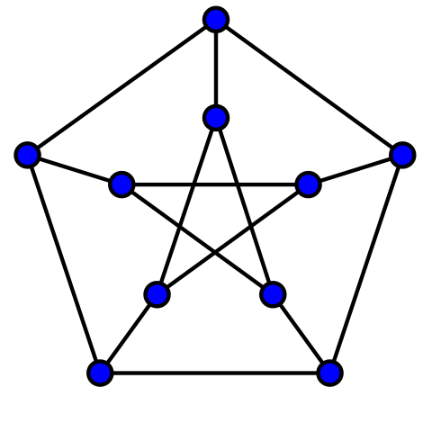
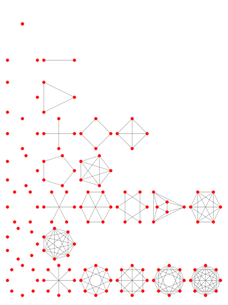
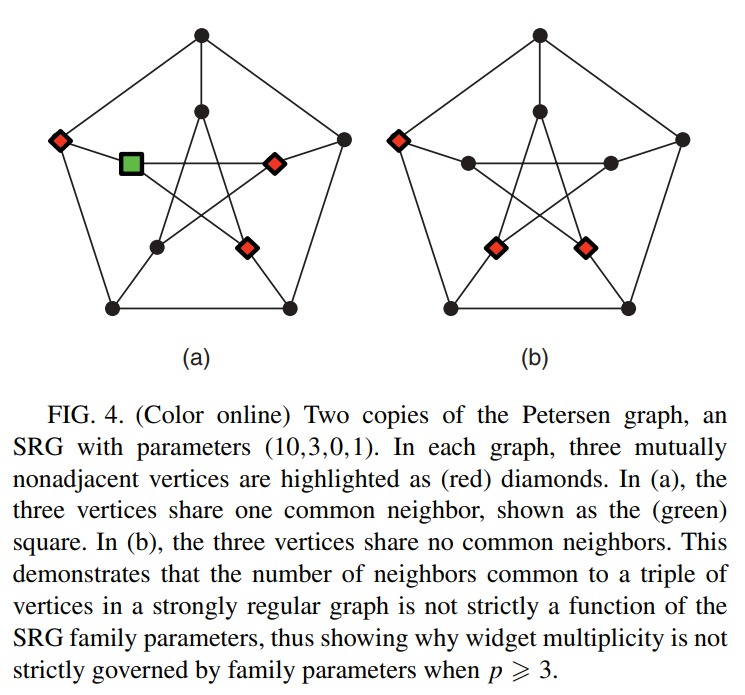
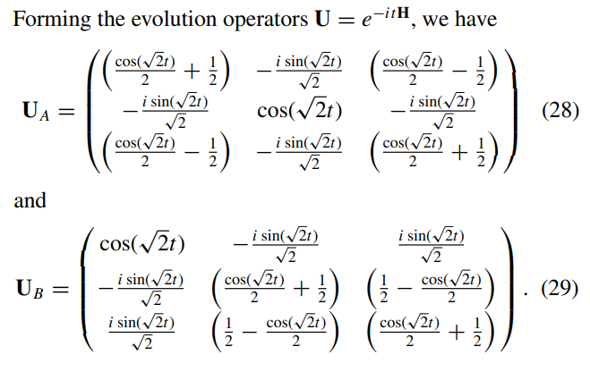
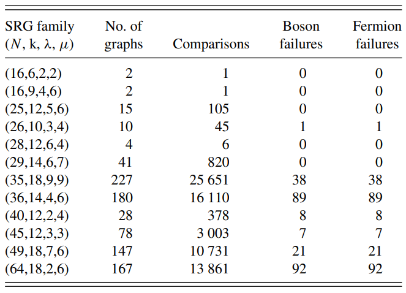
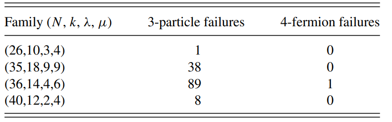

<!-- _class: lead -->
<!-- _footer: '' -->
<!-- _backgroundColor: #000 -->

# **STQM Term Project**
<!-- _paginate: false -->

Jyotirmaya Shivottam
1711069 
Oct 19, 2022

---
# Outline

* Graph Isomorphism
* Classical tests
* Strongly Regular Graphs
* Algorithm
* Intuition
* Limitation
* Results
* Extensions
* References
* [_Post-talk Questions_](./talk.md#25)

---

# Graph Isomorphism
* Let us denote two graphs as $G(V, E)$ and $H(V', E')$.

* A graph isomorphism is an edge-preserving bijection between the vertices of two graphs.
$$
f:V\to V'
$$

* If such a bijection exists, we call $G$ and $H$ isomorphic or $G \simeq H$.

* The GI problem is to determine whether two graphs are isomorphic or not, i.e. if one can be transformed into the other by a relabeling of vertices.

---
# Graph Isomorphism
* Adjacency matrix:
$$
A_{ij} = \begin{cases}
  1, \quad & \text{if } i \text{ and } j \text{ are connected} \\
  0, \quad & \text{otherwise}
\end{cases}
$$

* A graph with $N$ vertices has an $N\times N$ adjacency matrix.

* $G \simeq H$, iff there exists a permutation matrix, $P$, such that $A_G = P^{-1}A_HP$.

* Permutation matrix represents a relabeling of vertices.

* This problem is in the $NP$ complexity class and is purported to be NP-Intermediate (if $P \ne NP$).

---

---
# Classical tests

* Weisfeiler-Lehman (WL) test
  * Heuristic-based - _color-refinement_. <!-- iterative graph recolouring -->
  * Produces canonical vertex-label sets.
  * Iterative
  * A necessary but insufficient condition.
* VF(1, 2, 2++) algorithm for Graph Matching
  * Uses _partial edge-matching_.
  * Recursive.
  * Memory requirements grow exponentially with the number of vertices.
  * State-of-the-art.
* Best classical algorithm has a worst-case time complexity of $O(c^{\sqrt{N}\log N})$.
---
# WL test - Failure
* These two non-isomorphic graphs are reported as isomorphic (false-positive).

---
# WL test - Failure

* Fails in presence of graph automorphisms.
* Regular graphs usually have a large number of automorphisms.

---
# Strongly Regular Graphs (SRGs)

<!-- * A regular graph is a graph in which all vertices have the same degree ($k$). -->
* Is a _distance-regular_ graph with two properties:
  * Every two adjacent vertices have $\lambda$ common neighbours.
  * Every two non-adjacent vertices have $\mu$ common neighbours.
* Collectively, $\text{srg}(|V|=v, k, \lambda, \mu)$ denotes a SRG family (of graphs).
* Petersen graph is a SRG parameterized as $\text{srg}(10, 3, 0, 1)$.

---
# Some SRG properties

* Adjacency matrix for a SRG satisfies:
$$
\begin{align*}
A^2 &= (k - \mu)I + \mu J + (\lambda - \mu)A \\
JA &= AJ = kA \\
J^2 &= NJ
\end{align*}
$$
* Here, $J$ is a matrix of all ones and $I$ is identity.
* $\{I, J, A\}$ form a commutative 3-dimensional algebra, which leads us to;
$$
A^n = \alpha_n I + \beta_n J + \gamma_n A
$$
* $\alpha_n, \beta_n, \gamma_n$ are constants.

---
# Difficulties in distinguishing SRGs
* In principal, the GI problem can be retooled as calculating the canonical labeling via the automorphism group, which is also what classical approaches exploit.
  * The automorphism group of a SRG family is a non-trivial group.
  * Calculating the automorphism group is a problem at least as hard as the GI problem.
  * There are no known polynomial time solutions to either problem.
  * There are no known perfect oracles for either problem.
* Graphs in the same SRG family are co-spectral.
* Each SRG signature defining a family can contain several graphs. For instance, $\text{srg}(36, 15, 6, 6)$ has 32_548 graphs.

---
# Paper's approach
<!-- 
 

  

 -->
* Defines Continuous Time Quantum Walks (CTQW) on graphs.
* Uses the Hubbard model, without the short-range interaction term, where each site corresponds to a vertex.
$$
H = -\sum A_{ij}c_i^\dagger c_j
$$
* For bosons: $[c_i, c_j^\dagger] = \delta_{ij}$. $[c_i, c_j] = [c_i^\dagger, c_j^\dagger] = 0 \implies$ symmetrized basis states, with multi-occupancy.
* For fermions: $\{c_i, c_j^\dagger\} = \delta_{ij}$. $\{c_i, c_j\} = \{c_i^\dagger, c_j^\dagger\} = 0 \implies$ anti-symmetrized basis states, with single-occupancy.

---
# Paper's approach
* p-boson or p-fermion Hamiltonian can be given as:
$$
\begin{align*}
_B\braket{i_1,\dots,i_p|H_{p, B}|j_1,\dots,j_p}_B &= -_B\braket{i_1,\dots,i_p|A^{\oplus p}|j_1,\dots,j_p}_B \\
_F\braket{i_1,\dots,i_p|H_{p, B}|j_1,\dots,j_p}_F &= _F\braket{i_1,\dots,i_p|A^{\oplus p}|j_1,\dots,j_p}_F
\end{align*}
$$
* Where, $A^{\oplus p} = A\otimes I \otimes \dots + I \otimes A \otimes \dots + \dots + I \otimes \dots \otimes A$.
* The evolution operator is defined as usual:
$$
U(t) = e^{-iHt}
$$
* The elements of the resulting matrix are also termed _Green's functions_ (in the _correlator_ sense).

---
# Algorithm
1. Begin with the (complex) evolution matrix $U$.
1. Take the magnitude of each element.
2. Write all the (real) entries in a list, $X_A$.
3. Sort the list.
4. Compare the list using:
$$
\Delta = \sum_v |X_A[v] - X_B[v]|
$$
* If $\Delta \ne 0$, then $A$ and $B$ are non-isomorphic or distinguished.
* The converse is however not true, because non-isomorphic non-distinguished graphs (false negatives) can also have $\Delta = 0$.

---
# Intuition
* As an example, for the 3-particle walk, $U$ can be decomposed as: $U_{3B} = U_1^{\otimes 3}$ or $U_{3F} = \overline{U}_1^{\otimes 3}$, where $U_1 = e^{iAt}$ and $\overline{U}_1 = e^{-iAt}$.
* Recall the 3-algebra and decompose $U_1 = \alpha_n I + \beta_n J + \gamma_n A$.
* These constants depend only on SRG family parameters and $t$. Therefore:
  * All possible values of the Green's functions are determined by the family parameters.
  * Distinguishing power of the walks comes from the existence of at least one Green’s function with different multiplicities for nonisomorphic graphs in the same family.
  * Also see [Gamble et al (2010)](#23).

---
# Limitations
* The multiplicity of $G$ (Green's functions) in a $p$-particle walk depends on how many shared neighbors a collection of up to $p$ vertices has.
  * For 1 & 2-particle walks, $G$ are a function of only the family parameters, because strong regularity uniquely determines the number of shared neighbors.
  * For $p \ge 3$, this may not always be true, because the number of shared neighbors is dependent on the number of shared neighbors among sets of $p$ vertices.
  * This is the primary reason why the algorithm might return false negatives.
* Another reason is the choice of ordering of basis sets, which can flip the signs of the Green's functions, resulting in false-positives. The authors therefore take the absolute value to avoid this scenario and to avoid an exhaustive search for all $p^N$ orderings. This however results in a loss of phase information.

---
# Limitations
<!--   -->

  

---
# Limitations
<!--   -->

  

---
# Results
<!--  -->
<!--   -->

  

* 3-particle walks: 70_712 graph comparisons, with 256 failures (success > 99.6%).

---
# Results

  

* 4-particle walks, with near 100% accuracy.
* It should be noted that, in both cases, the authors have chosen subsets of families for large $N$, in order to reduce the number of comparisons.
* Also from these tables, it is clear that for $p = 3$, there is no difference between bosons and fermions.

---
## Own calculations
* I could not calculate $U_4$, and even for $U_3$, the largest family handled for all cases was $\text{srg}(16, 6, 2, 2)$, with 2 graphs (with correct results). ([Updated post-talk](#26))
* The code is available on [GitHub](#23).
* Issues faced:
  * $A$ and $H$ are large and non-sparse. So, diagonalization has to use slower methods.
  * Since we want accurate elements, iterative methods cannot be used.
  * The memory requirement blows up (exponential) in $N$.
  * The classical test also requires a long time to go through all the graphs and more importantly, is not guaranteed to be correct for large $N$.

---
# Extensions to this work
* The authors had purported that including the phase-information might improve the algorithm's results, especially for larger-$p$ or larger-$N$. [Mahasinghe et al](#24) however showed that phase-modified CTQW is still unable to distinguish strongly regular graphs, since the Green's functions are still not unique.
* Alternative approaches to this problem have also been published:
  * It has been [shown](#24) that DTQW evolves in a higher dimensional space, allowing it to possess extra distinguishing power on SRGs.
  * [Wang et al](#24) present an optimizing heuristic that omits the sorting step.
  * [Tamascelli et al](#24) present a QW-inspired adiabatic algorithm to reduce the search space and translate the problem to $2-$SAT.

---
# *References*
* [Link to GitHub repo for the code](https://github.com/JeS24/CTQW-graph-isomorphism)
* Using hyperlinks-only to preserve space.
* Main papers:
  1. Rudinger et al; [Noninteracting multiparticle quantum random walks applied to the graph isomorphism problem for strongly regular graphs](https://journals.aps.org/pra/abstract/10.1103/PhysRevA.86.022334)
  2. Gamble et al; [Two-particle quantum walks applied to the graph isomorphism problem](https://journals.aps.org/pra/abstract/10.1103/PhysRevA.81.052313)
* Classical approaches to GI:
  1. [A (sub)graph isomorphism algorithm for matching large graphs](https://ieeexplore.ieee.org/document/1323804)
  2. [VF2++—An improved subgraph isomorphism algorithm](https://www.sciencedirect.com/science/article/pii/S0166218X18300829)
  3. [On the Complexity of Canonical Labeling of Strongly Regular Graphs](https://epubs.siam.org/doi/abs/10.1137/0209018)

---
* SRG Data:
  1. [Public paramter database - A.E. Brouwer](https://homepages.cwi.nl/~aeb/math/srg/rk3/srgw.pdf)
  2. [Strongly Regular Graphs on at most 64 vertices](http://www.maths.gla.ac.uk/~es/srgraphs.php)
  3. [Collection of graphs](http://users.cecs.anu.edu.au/~bdm/data/graphs.html)
  4. [Strongly Regular Graph - Mathematica](https://mathworld.wolfram.com/StronglyRegularGraph.html)
* More recent works
  1. Rudinger et al; [Comparing algorithms for graph isomorphism using discrete- and continuous-time quantum random walks](https://arxiv.org/abs/1207.4535)
  2. Mahasinghe et al; [Phase-modified CTQW unable to distinguish strongly regular graphs efficiently](https://iopscience.iop.org/article/10.1088/1751-8113/48/26/265301)
  3. Wang et al; [A graph isomorphism algorithm using signatures computed via quantum walk search model](https://iopscience.iop.org/article/10.1088/1751-8113/48/11/115302/meta)
  4. Tamascelli et al; [A quantum-walk-inspired adiabatic algorithm for solving graph isomorphism problems](https://iopscience.iop.org/article/10.1088/1751-8113/47/32/325302)

---
* Image sources:
  * [Slide 5](#5) - [Wikipedia contributors. (2022). Graph isomorphism -- Wikipedia, The Free Encyclopedia.](https://en.wikipedia.org/wiki/Graph_isomorphism)
  * [Slide 7](#7) - [Sato, R. (2020). A Survey on The Expressive Power of Graph Neural Networks. arXiv e-prints, arXiv:2003.04078.](https://arxiv.org/abs/2003.04078)
  * [Slide 8](#8) - [Wikipedia contributors. (2022). Petersen graph -- Wikipedia, The Free Encyclopedia.](https://en.wikipedia.org/wiki/Petersen_graph)
  * [Slide 9](#9) - [Weisstein, Eric W. "Strongly Regular Graph." From MathWorld -- A Wolfram Web Resource.](https://mathworld.wolfram.com/StronglyRegularGraph.html)
  * [Slides 17-20](#17) - [Rudinger et al](#23)

---

# Post-talk Questions
* Non-interacting CTQW with particle number, $p = 1$ or $p = 2$:
  * The $p = 1$ & $p = 2$ walks are unable to distinguish between graphs from the same SRG family since the elements of $U$ are only dependent on the family parameters ($\alpha,\,\beta,\,\gamma$), and are therefore all identical.
  * Analytical proof of non-distinguishability is available in [this paper](https://arxiv.org/abs/quant-ph/0312170). This was also discussed by the authors in their previous work ([Gamble et al](#23)).
  * I have also shown this in code with a specific example taken from [Gamble et al](#23). Check the latter portion of `./code/example.ipynb` on [GitHub](https://github.com/JeS24/CTQW-graph-isomorphism)).
* In contrast, $p = 3$ (& $p = 4$) non-interacting CTQW has sufficient power to distinguish between non-isomorphic graphs from the same SRG family. I have replicated this result for $\text{srg}(16, 6, 2, 2)$ with $p = 3$ & $p = 4$, and $\text{srg}(26, 10, 3, 4)$ with only $p = 3$. CTQW with $p = 4$ led to an _OutOfMemory_ error.

---

* For $\text{srg}(16, 6, 2, 2)$ with 2 graphs and $^2C_2 = 1$ comparison:

| $p$ | Boson failures | Fermion failures | Peak Mem Usage (in GB) | Avg. CPU Time (in s) |
|:-----------:|:-----------------:|:------------:|:----:|:----:|
| 1 | 1 | 1 | 0.009 | 4.8 |
| 2 | 1 | 1 | 0.009 | 5.1 |
| 3 | 0 | 0 | 0.5 | 9.1 |
| 4 | 0 | 0 | 156 | 525.1 |
* For $\text{srg}((26, 10, 3, 4)$ with 10 graphs and $^{10}C_2 = 45$ comparisons:

| $p$ | Boson failures | Fermion failures | Peak Mem Usage (in GB) | Avg. CPU Time (in s) |
|:-----------:|:-----------------:|:------------:|:----:|:----:|
| 1 | 45 | 45 | 1.39 | 21.4 |
| 2 | 45 | 45 | 1.92 | 35.4 |
| 3 | 1 | 1 | 112	| 2547.5 |
